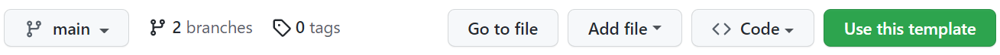
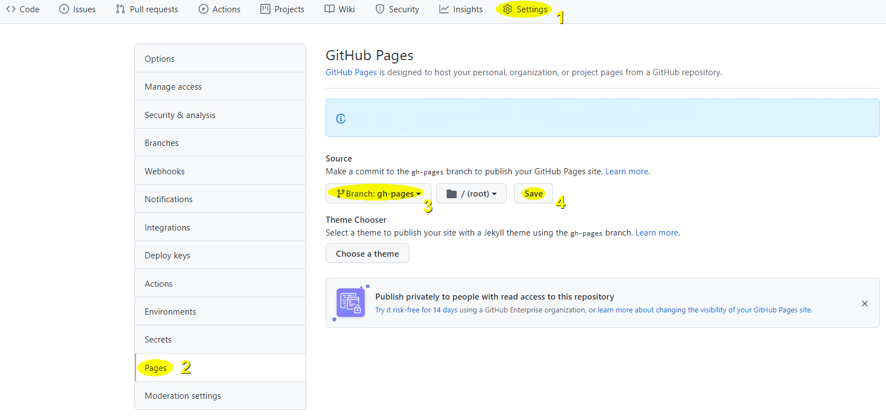

# Simple Obsidian MkDocs

Un simple modèle de dépôt GitHub pour publier des notes d'Obsidian via MkDocs avec le thème Material.

Le site ainsi produit est visible à l'adresse : <https://ericecmorlaix.github.io/simple_template_obsidian_mkdocs/>. Il montre quelques solutions permettant plus ou moins la transition de la syntaxe d'Obsidian vers celle de MkDocs.

Ce site est adossé à un [tutoriel (en construction)](https://ericecmorlaix.github.io/adn-Tutoriel_Obsidian/) qui présente la prise en main et quelques fonctionnalités d'Obisidian.

Ce template est basé sur <https://github.com/jobindjohn/obsidian-publish-mkdocs> et s'inspire également de <https://github.com/ObsidianPublisher/obsidian-mkdocs-publisher-template>

## Mise en place

1. **Créer** un nouveau dépôt GitHub à partir de ce modèle en cliquant sur le bouton vert ci-dessus ou cliquer sur [ce lien](https://github.com/ericECmorlaix/simple_template_obsidian_mkdocs/generate) ;

2. **Donner** un nom à votre dépôt public et **ajouter** une description. Par défaut vos notes seront publiées à l'adresse <https://votre-pseudo-github.github.io/nom-depot/> ;
 > ne copier que la branche `main` du dépôt template ;
3. **Cloner** le dépôt que vous venez de générer dans votre dossier/coffre d'Obsidian.  Soit avec le plugin Obsidian Git installé et activé dans votre coffre, ou directement en ligne de commande : 
```sh
cd votre_dossier-coffre
git clone url_du_depot`
```
4. **Glisser/déposer** les notes que vous souhaitez publier et leurs pièces jointes dans le dossier `docs` ;
5. **Commiter** puis **pousser** les changements avec Obsidian Git après avoir bien paramétré les options de ce plugin ;
6. GitHub Action va alors prendre en charge automatiquement la conversion de vos fichiers MarkDown d'Obsidian vers [MkDocs](https://www.mkdocs.org/) avec le thème [Material](https://squidfunk.github.io/mkdocs-material/) pour générer les fichiers au format HTML de votre site Web dans une branche `gh-page` ;
7. Depuis la page de votre dépôt sur GitHub, **Cliquer** sur les onglets `Settings` (1) puis `Pages` (2), **sélectionner** la branche `gh-pages` (3) enfin **cliquer** sur le bouton `Save` (4) :

> Au bout d'un moment, si tout se passe bien, votre site devrait être visible sur le web à l'adresse <https://votre-pseudo-github.github.io/nom-depot/>

8. Si cela ne fonctionne vraiment pas pour vous, ouvrez une [issue](https://github.com/ericECmorlaix/simple_template_obsidian_mkdocs/issues/new/choose) et expliquez moi votre problème...

## Configuration de votre site

Les fichiers de configuration du site `mkdocs.yml` et `ci.yml` sont écrits en [YAML](https://fr.wikipedia.org/wiki/YAML), un langage avec une syntaxe la plus lisible possible par des humains pour représenter des données.

Obsidian ne permet pas d'éditer ces fichiers. Il vous faudra les ouvrir dans votre éditeur de texte favori ou directement les éditer dans GitHub pour les modifier afin de les personnaliser :

- Sauf à vouloir ajouter de nouvelles fonctionnalités, le fichier [`CI.yml`](https://ericecmorlaix.github.io/adn-Tutoriel_site_web/Yaml/#le-fichier-ciyml) peut rester inchangé ;
- En revanche, il est nécessaire de modifier le fichier `mkdocs.yml` en s'aidant des explications laissées en commentaires ou encore de celles ce [tutoriel de configuration d'un site web avec MkDocs](https://ericecmorlaix.github.io/adn-Tutoriel_site_web/Yaml/#le-fichier-mkdocsyml)

## Les futures pages de votre site

Le texte en MarkDown de la page `index.md` du dossier `/docs` devient la page d'accueil en HTML de votre site.

Les dossiers présents dans `/docs` apparaissent comme sections principales de la barre de navigation. De même pour le titre de niveau 1 `# Accueil` écrit au début du fichier `index.md`.

Chaque note, `fichier.md` écrit en MarkDown, devient une nouvelle page du site dans leur section respective. Le noms de ces fichiers sont visible dans la barre d'URL. Les titres et sous-titres de la table des matières apparaissent dans des sous-sections d'un menu secondaire.

> En l'absence de titre de niveau 1 au début d'une note, c'est le nom du fichier qui apparaitra en tête de la sous-section.

Il est donc préférable dans Obsidian d'attribuer aux dossiers et fichiers des noms significatifs, sans caractère accentué ni espace et, de même que pour les titres et sous-titres, le mieux est de les choisir courts. 

> Ce nommage automatique peut-être modifié en définissant manuellement la rubrique `nav` dans le fichier `mkdocs.yml`, ce qui devient cependant vite fastidieux...

## Autres projets à regarder

- <https://github.com/ObsidianPublisher/obsidian-mkdocs-publisher-template> La solution de [Lisandra Simonetti](https://github.com/Lisandra-dev), beaucoup plus évoluée et associée à un plugin d'Obsidian.
- <https://github.com/mr-karan/notes>
- <https://github.com/jimbrig/obsidian_published>
- <https://github.com/Jackiexiao/foam-mkdocs-template>
- <https://github.com/foambubble/foam-template>
- <https://sarthaknarayan.tech/projects/obsidian-publish-github-action/>
- <https://github.com/mathieudutour/gatsby-digital-garden>
- <https://github.com/TuanManhCao/digital-garden>
- <https://forum.obsidian.md/t/my-obsidian-mkdocs-workflow/24424> | <https://tarekshehata.github.io/alkashi/>
 
