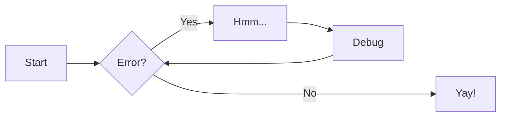

# Diagramme Mermaid

Exemple de [MkDocs Material documentation](https://squidfunk.github.io/mkdocs-material/reference/diagrams/#using-flowcharts): 

>[!info]
> Pensez à actualiser la page du site MkDocs pour obtenir l'affichage correct du diagramme...

> [!tip] C'est [mkdocs-mermaid2-plugin](https://github.com/fralau/mkdocs-mermaid2-plugin) qui permet ici l'affichage de ce genre de diagrammes.